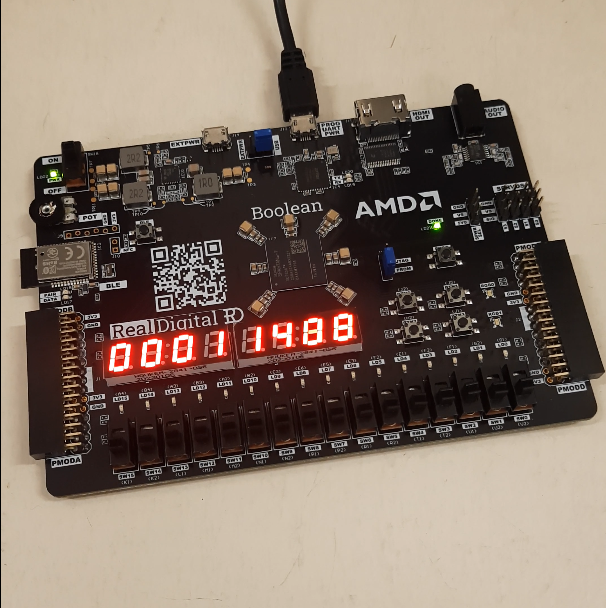

# UART RECIEVER FOR FPGA

   <!-- Replace with your image link -->

## Overview

Welcome to the **FPGA Counter** repository! This project is a simple implementation of a counter on fpga. The counter counts at 1KHz and displays on the two seven segment displays on the board.

The constraints (.xdc) on the project is for boolean fpga board (Real digital), you just need to include the master constraints file and uncomment required outputs and inputs.
### Working

-  1: First the 100 MHz clock is used to generate a 1 Khz clock.
-  2: This is done by counting 100,000 times and creating a posedge.
-  3: The posedge is picked up by another always block and 1 KHz clk is generated.

## Installation

To get started with the project, you need to clone this repository onto vivado.

### Prerequisites

Ensure you have the following tools installed on your machine:

- **Tool 1**: Vivado design suite

### Steps to access verilog code directly

```bash
(1) Goto Uart_Reciever.srcs
(2) Goto sources_1

